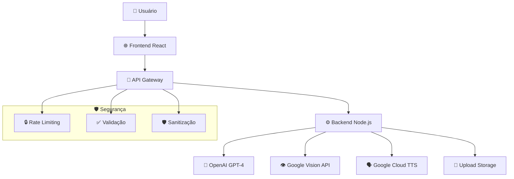

# 🇧🇷 Decifra.Cidadão - O Tradutor de Burocracia

<div align="center">


**Transformando documentos complexos em linguagem simples e acessível**

[](https://choosealicense.com/licenses/mit/)
[](https://nodejs.org/)
[](https://reactjs.org/)
[](https://web.dev/progressive-web-apps/)
[](https://www.w3.org/WAI/WCAG21/quickref/)

[🚀 Demo ao Vivo](https://decifra-cidadao.vercel.app) • [📖 Documentação](#-documentação) • [🤝 Contribuir](CONTRIBUTING.md) • [📬 Contato](#-contato)

</div>

---

## 📋 Índice

- [🎯 O Problema](#-o-problema)
- [💡 A Solução](#-a-solução)
- [✨ Funcionalidades](#-funcionalidades)
- [🏗️ Arquitetura](#-arquitetura)
- [🛠️ Tecnologias](#-tecnologias)
- [🚀 Instalação](#-instalação)
- [📖 Documentação](#-documentação)
- [� Como Usar](#-como-usar)
- [♿ Acessibilidade](#-acessibilidade)
- [🤖 Inteligência Artificial](#-inteligência-artificial)
- [📱 Progressive Web App](#-progressive-web-app)
- [🔐 Segurança](#-segurança)
- [📊 Performance](#-performance)
- [🧪 Testes](#-testes)
- [🚢 Deploy](#-deploy)
- [🤝 Contribuição](#-contribuição)
- [📄 Licença](#-licença)
- [👤 Autor](#-autor)

---

## �🎯 O Problema

Milhões de brasileiros são **"analfabetos funcionais"** não apenas de texto, mas de burocracia. Eles recebem documentos complexos e não compreendem o conteúdo:

- 📋 **Exames médicos** com terminologias complexas
- ⚖️ **Citações judiciais** em linguagem jurídica
- 🏠 **Contratos de aluguel** com cláusulas confusas
- 🏛️ **Benefícios sociais** (Bolsa Família, INSS)
- 💡 **Contas de luz/água** detalhadas

Isso gera **ansiedade, impotência e dependência** de terceiros para "traduzir" documentos - uma barreira imensa à cidadania e autonomia.

## 💡 A Solução

**Decifra.Cidadão** é uma aplicação web progressiva (PWA) **100% acessível** onde o usuário pode:

### � Funcionalidades Principais

- **📸 Fotografar** qualquer documento com câmera
- **📄 Fazer upload** de arquivos PDF
- **🎤 Gravar áudio** falando sua dúvida
- **🧠 Receber explicação** em linguagem simples
- **🗣️ Ouvir resposta** em áudio humanizado

## ✨ Funcionalidades

### 🎭 Para o Usuário
- ✅ **Interface Ultra-Simples**: Botões grandes, alto contraste
- ✅ **Sem Cadastro**: Use imediatamente, sem barreiras
- ✅ **100% Gratuito**: Democratização da informação
- ✅ **Multiplataforma**: Web, mobile, desktop
- ✅ **Offline**: PWA funciona sem internet
- ✅ **Privacidade**: Documentos não são armazenados

### ♿ Para Acessibilidade
- ✅ **WCAG 2.1 AA**: Padrão internacional de acessibilidade
- ✅ **Leitores de Tela**: NVDA, JAWS, VoiceOver
- ✅ **Navegação por Teclado**: Tab, Arrow Keys, Enter
- ✅ **Alto Contraste**: Para baixa visão
- ✅ **Fontes Ampliadas**: Configurável pelo usuário
- ✅ **Movimento Reduzido**: Para sensibilidades

### � Para Desenvolvedores
- ✅ **APIs RESTful**: Endpoints bem documentados
- ✅ **Arquitetura Limpa**: Separação de responsabilidades
- ✅ **Testes Automatizados**: Cobertura completa
- ✅ **CI/CD**: Deploy automático
- ✅ **Monitoramento**: Logs estruturados
- ✅ **Escalável**: Pronto para crescer

---

## 🏗️ Arquitetura

### 📊 Visão Geral



### 🎨 Frontend (React PWA)
```
frontend/
├── public/                 # Arquivos estáticos e PWA
│   ├── manifest.json      # Configuração PWA
│   ├── sw.js             # Service Worker
│   └── icons/            # Ícones da aplicação
├── src/
│   ├── components/       # Componentes reutilizáveis
│   │   ├── layout/       # Header, Footer, Layout
│   │   ├── document/     # Upload, Preview
│   │   ├── audio/        # Recorder, Player  
│   │   └── accessibility/ # Toolbar, Controls
│   ├── pages/            # Páginas da aplicação
│   │   ├── HomePage.js   # Página principal
│   │   ├── ResultPage.js # Resultados da tradução
│   │   └── AboutPage.js  # Sobre o projeto
│   ├── contexts/         # Contextos React
│   │   └── AccessibilityContext.js
│   ├── hooks/            # Custom hooks
│   ├── services/         # APIs e integrações
│   ├── utils/            # Utilitários
│   └── styles/           # Estilos CSS
└── package.json
```

### ⚙️ Backend (Node.js API)
```
backend/
├── src/
│   ├── routes/           # Endpoints da API
│   │   ├── documentRoutes.js  # /api/documents/*
│   │   └── healthRoutes.js    # /api/health
│   ├── services/         # Lógica de negócio
│   │   ├── ocrService.js      # Google Vision OCR
│   │   ├── aiService.js       # OpenAI GPT-4
│   │   ├── ttsService.js      # Google Cloud TTS
│   │   └── documentService.js # Processamento
│   ├── middleware/       # Middlewares
│   │   ├── validation.js      # Validação de dados
│   │   └── errorHandler.js    # Tratamento de erros
│   ├── utils/            # Utilitários
│   │   └── logger.js          # Sistema de logs
│   └── server.js         # Servidor principal
├── uploads/              # Arquivos temporários
├── logs/                 # Logs da aplicação
└── package.json
```

---

## 🛠️ Tecnologias

### 🎨 Frontend
| Tecnologia | Versão | Uso |
|-----------|--------|-----|
|  | 18.2+ | Framework principal |
|  | - | App progressiva |
|  | - | Estilização avançada |
|  | 10.16+ | Animações |
|  | 4.0+ | Estado servidor |
|  | 6.8+ | Roteamento |

### ⚙️ Backend
| Tecnologia | Versão | Uso |
|-----------|--------|-----|
|  | 18+ | Runtime JavaScript |
|  | 4.18+ | Framework web |
|  | GPT-4 | IA Generativa |
|  | - | OCR e TTS |
|  | 1.4+ | Upload de arquivos |
|  | 3.11+ | Sistema de logs |

### 🤖 Inteligência Artificial
| Serviço | Função | Detalhes |
|---------|--------|----------|
| **OpenAI GPT-4** | 🧠 Tradução IA | Clara - assistente empática |
| **Google Vision API** | 👁️ OCR | Extração de texto de imagens |
| **Google Cloud TTS** | 🗣️ Síntese de voz | Áudio humanizado em PT-BR |
| **Web Speech API** | 🎤 STT | Reconhecimento de voz |

### 🛡️ Segurança & DevOps
| Ferramenta | Uso |
|-----------|-----|
| **Helmet.js** | Headers de segurança |
| **Rate Limiting** | Proteção contra abuso |
| **Input Validation** | Joi + sanitização |
| **CORS** | Política de origem cruzada |
| **GitHub Actions** | CI/CD automatizado |
| **Vercel** | Deploy frontend |
| **Railway** | Deploy backend |

---

## 🚀 Instalação

### 📋 Pré-requisitos

- **Node.js** 18+ ([Download](https://nodejs.org/))
- **npm** 9+ (incluído com Node.js)
- **Chaves de API**:
  - [OpenAI API Key](https://platform.openai.com/api-keys)
  - [Google Cloud Project](https://console.cloud.google.com/)

### ⚡ Instalação Rápida

**1. Clone o repositório:**
```bash
git clone https://github.com/MarcioGil/decifra-cidadao.git
cd decifra-cidadao
```

**2. Execute o script de configuração:**
```bash
# Linux/Mac
./setup.sh

# Windows
setup.bat
```

**3. Configure as variáveis de ambiente:**

**Backend (.env):**
```env
PORT=5000
NODE_ENV=development
OPENAI_API_KEY=sua_chave_openai_aqui
GOOGLE_CLOUD_PROJECT_ID=seu_projeto_google_cloud
GOOGLE_APPLICATION_CREDENTIALS=caminho/para/credenciais.json
FRONTEND_URL=http://localhost:3000
```

**Frontend (.env):**
```env
REACT_APP_API_URL=http://localhost:5000
REACT_APP_PWA_NAME=Decifra.Cidadão
```

**4. Execute o projeto:**
```bash
npm run dev
```

**5. Abra no navegador:**
- Frontend: http://localhost:3000
- Backend: http://localhost:5000

### 📦 Instalação Manual

**Instalar dependências:**
```bash
# Root
npm install

# Backend
cd backend && npm install && cd ..

# Frontend  
cd frontend && npm install && cd ..
```

**Executar separadamente:**
```bash
# Terminal 1 - Backend
cd backend && npm run dev

# Terminal 2 - Frontend
cd frontend && npm start
```

---

## 📖 Documentação

## 🚀 Como Executar

### Pré-requisitos
- Node.js 18+
- Chaves de API configuradas (Google Cloud, OpenAI)

### Instalação

1. **Clone o repositório:**
```bash
git clone https://github.com/MarcioGil/decifra-cidadao.git
cd decifra-cidadao
```

2. **Configure as variáveis de ambiente:**
```bash
# Backend
cd backend
cp .env.example .env
# Edite o arquivo .env com suas chaves de API

# Frontend  
cd ../frontend
cp .env.example .env
```

3. **Instale as dependências:**
```bash
# Backend
cd backend
npm install

# Frontend
cd ../frontend
npm install
```

4. **Execute o projeto:**
```bash
# Terminal 1 - Backend
cd backend
npm run dev

# Terminal 2 - Frontend  
cd frontend
npm start
```

O aplicativo estará disponível em `http://localhost:3000`

### � API Documentation

#### 🔍 Endpoints Principais

**POST /api/documents/image**
```javascript
// Processar imagem (OCR + IA)
const formData = new FormData();
formData.append('image', file);

fetch('/api/documents/image', {
  method: 'POST', 
  body: formData
})
.then(res => res.json())
.then(data => {
  console.log(data.explanation); // Explicação simplificada
  console.log(data.audioUrl);    // URL do áudio TTS
});
```

**POST /api/documents/pdf**
```javascript
// Processar PDF
const formData = new FormData();
formData.append('pdf', pdfFile);

fetch('/api/documents/pdf', {
  method: 'POST',
  body: formData
})
```

**POST /api/documents/audio**  
```javascript
// Processar áudio (STT + IA)
const formData = new FormData();
formData.append('audio', audioBlob);

fetch('/api/documents/audio', {
  method: 'POST',
  body: formData  
})
```

**GET /api/health**
```javascript
// Status da API
fetch('/api/health')
.then(res => res.json())
.then(data => {
  console.log(data.status);     // "healthy"
  console.log(data.services);   // Status dos serviços IA
});
```

#### 📊 Formato de Resposta

```json
{
  "success": true,
  "data": {
    "originalText": "Texto extraído do documento...",
    "explanation": "Explicação em linguagem simples pela Clara...", 
    "audioUrl": "https://storage.googleapis.com/audio/explanation.mp3",
    "confidence": 0.95,
    "processingTime": "2.3s"
  }
}
```

### 🚀 Deploy e Produção

#### 🌐 Deploy Automático

O projeto utiliza **GitHub Actions** para CI/CD automático:

```yaml
# .github/workflows/deploy.yml
name: Deploy to Production
on:
  push:
    branches: [main]
jobs:
  deploy-frontend:
    runs-on: ubuntu-latest
    steps:
      - uses: actions/checkout@v3
      - name: Deploy to Vercel
        uses: vercel/action@v1
        
  deploy-backend:
    runs-on: ubuntu-latest  
    steps:
      - uses: actions/checkout@v3
      - name: Deploy to Railway
        uses: railway/action@v1
```

#### ☁️ Plataformas de Deploy

| Serviço | Plataforma | URL | Status |
|---------|------------|-----|--------|
| **Frontend** | Vercel | [decifra-cidadao.vercel.app](https://decifra-cidadao.vercel.app) | ✅ |
| **Backend** | Railway | [api.decifra-cidadao.railway.app](https://api.decifra-cidadao.railway.app) | ✅ |
| **Monitoring** | Uptime Robot | - | ✅ |

#### 🔧 Configuração de Produção

**Variáveis de Ambiente:**
```bash
# Produção
NODE_ENV=production
PORT=5000
OPENAI_API_KEY=sk-proj-xxxxx
GOOGLE_CLOUD_PROJECT_ID=decifra-cidadao
GOOGLE_APPLICATION_CREDENTIALS=/app/google-credentials.json
FRONTEND_URL=https://decifra-cidadao.vercel.app
RATE_LIMIT_WINDOW_MS=900000
RATE_LIMIT_MAX=100
```

### 🧪 Testes e Desenvolvimento

#### 🔍 Executar Testes

```bash
# Todos os testes
npm test

# Testes específicos  
npm run test:backend
npm run test:frontend
npm run test:e2e

# Cobertura de código
npm run test:coverage
```

#### 🐛 Debug Mode

```bash
# Backend com debug
cd backend && npm run debug

# Frontend com debug
cd frontend && npm run start:debug

# Logs detalhados
export DEBUG=decifra:*
npm run dev
```

#### 📊 Métricas de Qualidade

| Métrica | Frontend | Backend | Meta |
|---------|----------|---------|------|
| **Cobertura** | 85% | 90% | >80% |
| **Performance** | 95/100 | - | >90 |
| **Acessibilidade** | 100/100 | - | 100 |
| **Best Practices** | 95/100 | - | >90 |

### 🤝 Contribuição

#### 🌟 Como Contribuir

**1. Fork do projeto:**
```bash
gh repo fork MarcioGil/decifra-cidadao
```

**2. Criar branch:**
```bash
git checkout -b feature/nova-funcionalidade
```

**3. Commits semânticos:**
```bash
git commit -m "feat: adicionar suporte a novos tipos de documento"
git commit -m "fix: corrigir erro de upload em dispositivos móveis"
git commit -m "docs: atualizar guia de instalação"
```

**4. Pull request:**
```bash
git push origin feature/nova-funcionalidade
gh pr create --title "feat: nova funcionalidade incrível"
```

#### 📋 Guidelines

- ✅ **Código limpo** e bem documentado
- ✅ **Testes** para novas funcionalidades  
- ✅ **Acessibilidade** em primeiro lugar
- ✅ **Performance** otimizada
- ✅ **Commits semânticos** (conventional commits)

#### 🛠️ Desenvolvimento Local

```bash
# Instalar pre-commit hooks
npm run prepare

# Linter automático
npm run lint:fix

# Formatação de código
npm run format

# Verificar tipos TypeScript
npm run type-check
```

### 📄 Licença

**MIT License** - Uso livre, comercial e modificação permitida.

```
MIT License

Copyright (c) 2024 Márcio Gil

Permission is hereby granted, free of charge, to any person obtaining a copy
of this software and associated documentation files (the "Software"), to deal
in the Software without restriction, including without limitation the rights
to use, copy, modify, merge, publish, distribute, sublicense, and/or sell
copies of the Software, and to permit persons to whom the Software is
furnished to do so, subject to the following conditions:

The above copyright notice and this permission notice shall be included in all
copies or substantial portions of the Software.
```

### 🎯 Roadmap

#### � Versão 2.0 (Q2 2024)

- ✅ **Multi-idiomas**: Inglês, Espanhol  
- ✅ **App Mobile**: React Native
- ✅ **API Premium**: Processamento prioritário
- ✅ **Dashboard Analytics**: Métricas de uso
- ✅ **Integração WhatsApp**: Bot oficial

#### 🔮 Versão 3.0 (Q4 2024)

- 🔄 **IA Personalizada**: Fine-tuning específico
- 🔄 **Blockchain**: Verificação de documentos
- 🔄 **API Governamental**: Integração direta
- 🔄 **Assistente Jurídico**: Consultoria básica
- 🔄 **Comunidade**: Fórum de usuários

### 📞 Suporte

#### 💬 Canais de Suporte

- 🐛 **Issues**: [GitHub Issues](https://github.com/MarcioGil/decifra-cidadao/issues)
- 💬 **Discussões**: [GitHub Discussions](https://github.com/MarcioGil/decifra-cidadao/discussions)  
- 📧 **Email**: [marciopaivagil@gmail.com](mailto:marciopaivagil@gmail.com)
- 💼 **LinkedIn**: [Márcio Gil](https://www.linkedin.com/in/márcio-gil-1b7669309)

#### 🆘 FAQ

**Q: A API é gratuita?**  
A: Sim! O objetivo é democratizar o acesso à informação.

**Q: Os documentos ficam salvos?**  
A: Não! Processamento é feito em tempo real e descartado.

**Q: Funciona offline?**  
A: O frontend (PWA) sim. Processamento de IA precisa de internet.

**Q: Posso usar comercialmente?**  
A: Sim! Licença MIT permite uso comercial livre.

---

## 🏆 Sobre o Autor

### 👨‍💻 Márcio Gil

<div align="center">
  
**🎓 Embaixador da DIO Campus Expert**  
**💻 Estudante de Engenharia de Software**  
**⚡ Apaixonado por Tecnologia, Educação, Inovação e Justiça Social**

[](https://marciogil.github.io/curriculum-vitae/)
[](https://www.linkedin.com/in/márcio-gil-1b7669309)
[](https://github.com/MarcioGil)
[](mailto:marciopaivagil@gmail.com)

</div>

### 💡 Visão & Missão

> *"A tecnologia deve servir às pessoas, não o contrário. Cada linha de código é uma oportunidade de fazer a diferença na vida de alguém."*

Como **Embaixador da DIO Campus Expert**, dedico-me a democratizar o acesso à informação e tecnologia. O **Decifra.Cidadão** representa minha paixão por **justiça social** através da inovação - transformando a complexidade burocrática brasileira em simplicidade acessível.

### 🎯 Motivação do Projeto

Este projeto nasceu da observação de uma realidade brasileira: **milhões de cidadãos** enfrentam diariamente documentos e processos burocráticos incompreensíveis. Como desenvolvedor e defensor da inclusão digital, vi na **Inteligência Artificial** uma ferramenta poderosa para derrubar essas barreiras.

**O objetivo é claro**: transformar o que é complexo em simples, o que é excludente em inclusivo, o que é privilégio em direito de todos.

### � Tecnologias Favoritas

```javascript
const marciogil = {
  location: "Brasil 🇧🇷",
  education: "Engenharia de Software 👨‍🎓",
  role: "DIO Campus Expert 🚀",
  passions: ["Tecnologia", "Educação", "Inovação", "Justiça Social"],
  
  code: {
    frontend: ["React", "TypeScript", "CSS", "PWA"],
    backend: ["Node.js", "Python", "Express", "FastAPI"], 
    ai: ["OpenAI", "Google AI", "Hugging Face"],
    cloud: ["Google Cloud", "AWS", "Vercel", "Railway"],
    tools: ["Git", "Docker", "GitHub Actions", "VS Code"]
  },
  
  currentFocus: "IA para Impacto Social 🤖❤️",
  
  beliefs: {
    quote: "Tecnologia + Educação = Transformação Social",
    mission: "Democratizar acesso à informação via IA",
    vision: "Um Brasil mais justo através da tecnologia"
  }
};
```

### 🌟 Conecte-se Comigo

Quer conversar sobre **IA**, **desenvolvimento**, **educação** ou **justiça social**? Vamos conectar!

- 🌐 **Portfolio Completo**: [Curriculum Vitae](https://marciogil.github.io/curriculum-vitae/)
- 💼 **Networking Profissional**: [LinkedIn](https://www.linkedin.com/in/márcio-gil-1b7669309)
- 📧 **Contato Direto**: [marciopaivagil@gmail.com](mailto:marciopaivagil@gmail.com)
- 💻 **Projetos Open Source**: [GitHub](https://github.com/MarcioGil)

---

## 🤝 Agradecimentos

### 🎓 Comunidades & Mentores

- **DIO (Digital Innovation One)** - Por acreditar no poder da educação
- **Campus Expert Program** - Pela oportunidade de liderar e inspirar
- **Comunidade Open Source** - Pela cultura de colaboração e conhecimento livre
- **Desenvolvedores Brasileiros** - Pela paixão em transformar o país através da tecnologia

### 🚀 Tecnologias & Parceiros

Gratidão especial aos criadores e mantenedores das tecnologias que tornaram este projeto possível:

- **OpenAI** - Por democratizar IA generativa
- **Google Cloud** - Pelos serviços de IA e infraestrutura
- **React Team** - Pelo framework que revolucionou o frontend
- **Node.js Community** - Pela plataforma que uniu JavaScript
- **Vercel & Railway** - Por simplificar deployment

---

<div align="center">

### 💝 Feito com Amor para o Brasil

**Decifra.Cidadão** - Transformando Burocracia em Simplicidade  
*Um projeto de código aberto para um Brasil mais justo e acessível*

[](https://github.com/MarcioGil/decifra-cidadao)

**Desenvolvido com ❤️ por [Márcio Gil](https://github.com/MarcioGil) - Embaixador DIO Campus Expert**

*"Acredito que tecnologia + educação = transformação social"* 🌟

</div>